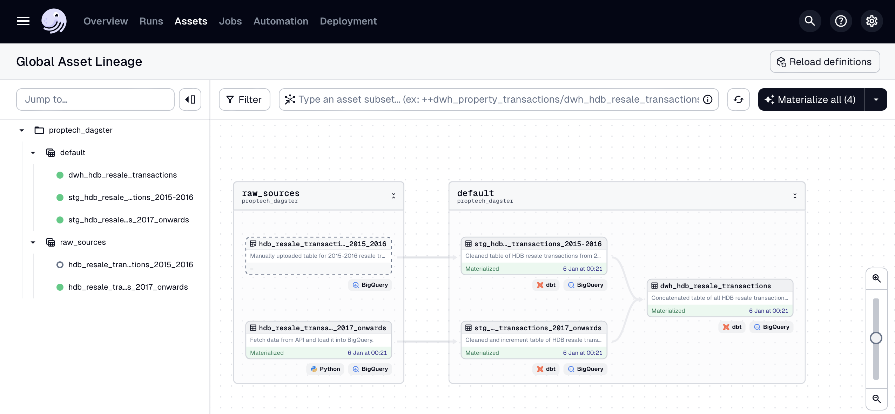
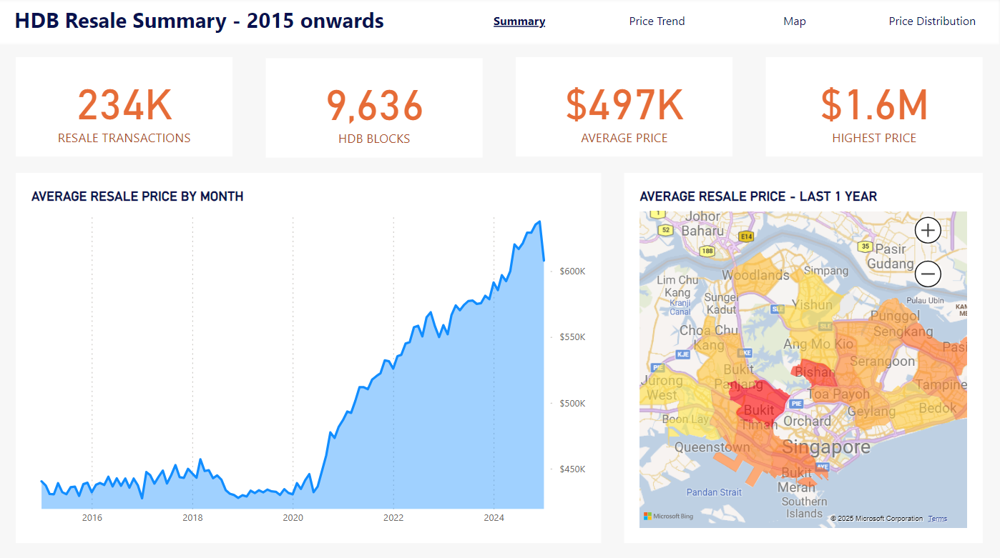
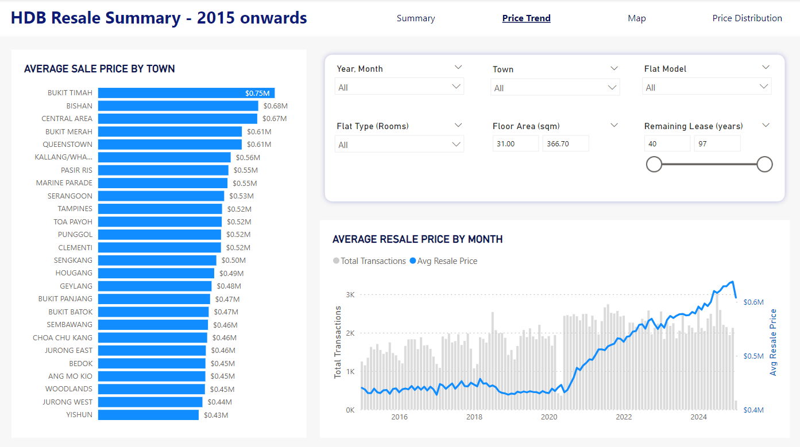
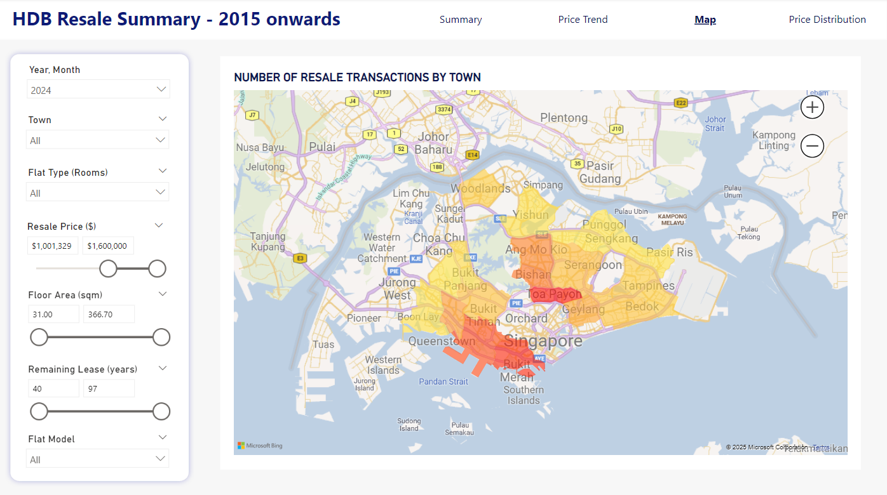
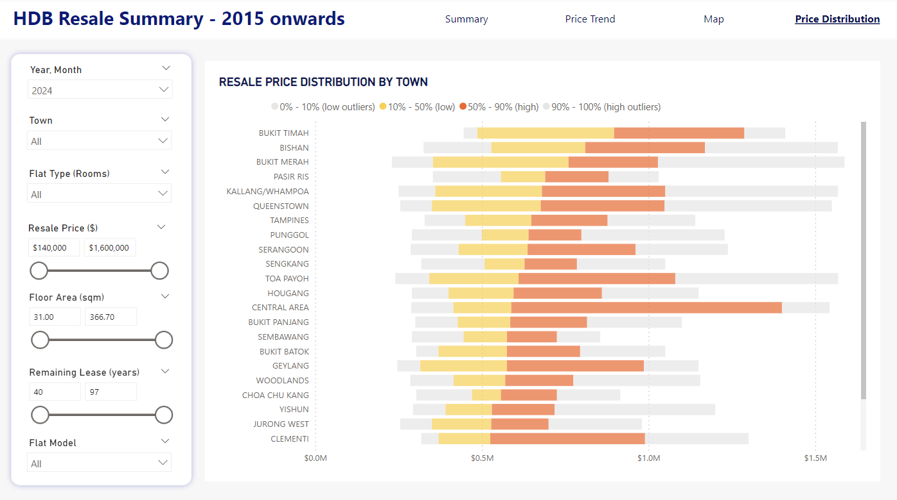

# End-to-End Data Pipeline with Dagster, dbt, and Power BI

## Project Overview

This project leverages **[Dagster](https://dagster.io/)** and **[dbt](https://www.getdbt.com/)** to build an ELT pipeline that orchestrate and transform real estate data, specifically **HDB resale transactions** in Singapore. The goal of the project is to automate the data pipeline from raw data collection, transformation, integration, and final storage in BigQuery for reporting and analytics.

Below is a visualization of the data lineage for the project, showing how data flows from raw sources to the final data warehouse for reporting.

**Tech Stack**: Python , SQL , dbt , Dagster , PowerBI 

**Skills**: Data warehousing, Data orchestration, transformation and integration, visualization

### **Project Structure**

The project is divided into multiple stages:

1. **Raw Data Collection**:
   - Data is uploaded from CSV files and API requests into **Google BigQuery** in the `dl_property_transactions` dataset. The two raw tables are:
     - `hdb_resale_transactions_2015-2016`: Contains HDB resale data for the period 2015-2016.
     - `hdb_resale_transactions_2017_onwards`: Contains HDB resale data for the period 2017 and onwards, loaded via an **API** from data.gov.sg using Python.

2. **DBT Transformations**:
   - DBT is used to transform and clean the raw data in BigQuery. The key transformation steps include:
     - **Staging Layer (`stg_property_transactions`)**: Clean the raw data by casting columns to the correct data types (e.g., `FLOAT64`, `INT64`, etc.).
     - **Warehouse Layer (`dwh_property_transactions`)**: Concatenate and join the transformed data from both `stg_property_transactions` tables into a final data warehouse table for reporting.
     - The final table in the `dwh_property_transactions` dataset is **clustered by month** to optimize query performance, as queries often filter by month.

3. **Dagster Orchestration**:
   - Dagster orchestrates the entire pipeline. It ensures that data is loaded, transformed, and scheduled according to the defined schedule:
     - **Weekly Schedule**: Every Wednesday at midnight, the `materialize_all` job runs to refresh the DBT models and load the latest data.

### Analytics layer: Power BI Dashboard
The Power BI Dashboard is designed to explore and analyze HDB resale transactions in Singapore from 2015 to 2024, leveraging the final table `dwh_hdb_resale_transactions` for insights. It provides an interactive, user-friendly interface to uncover trends, compare attributes, and gain valuable insights into the resale market.

Overview page:

Price Trend page:

Geospatial Analysis page:

Price Distribution page:

---

## **Key Highlights**

1. **Loading Data via API**:
   - The **`hdb_resale_transactions_2017_onwards`** table is loaded into BigQuery from the data.gov.sg API using Python. The API call retrieves the HDB resale data for the period 2017 onwards and loads it into BigQuery for further processing.

2. **Incremental Materialization**:
   - The **`stg_hdb_resale_transactions_2017_onwards`** table is incrementally materialized in DBT. This materialization mode is used to update only the new or changed data from the raw source, rather than reprocessing the entire table. It helps in optimizing performance by reducing the amount of data processed during each refresh.

3. **Clustered Warehouse Table**:
   - The final **`dwh_property_transactions`** table is clustered by the `month` column. This clustering is designed to optimize query performance for queries that frequently filter or group by the `month` field.

---

## **Skills & Technologies Used**

- **Python**: Used for API data extraction and integration with BigQuery.
- **SQL**: Used for data transformation and querying in dbt and BigQuery.
- **Data Warehousing**: Implemented in dbt and BigQuery, including staging, transformation, and final data warehouse layers.
- **Data Orchestration**: Dagster is used to automate and schedule the data pipeline, ensuring consistent data processing and transformation.

---

## **Future Work**

- **Deploy on Cloud Server**: Host the project on a cloud server for better scalability and manageability.
- **Advanced Analytics**: Integrate the data with advanced analytics platforms such as **Power BI** or **Looker** and create more insightful dashboards.
- **Add sale transactions of Condo**: Another workflow for Condominium sale transactions.

---
